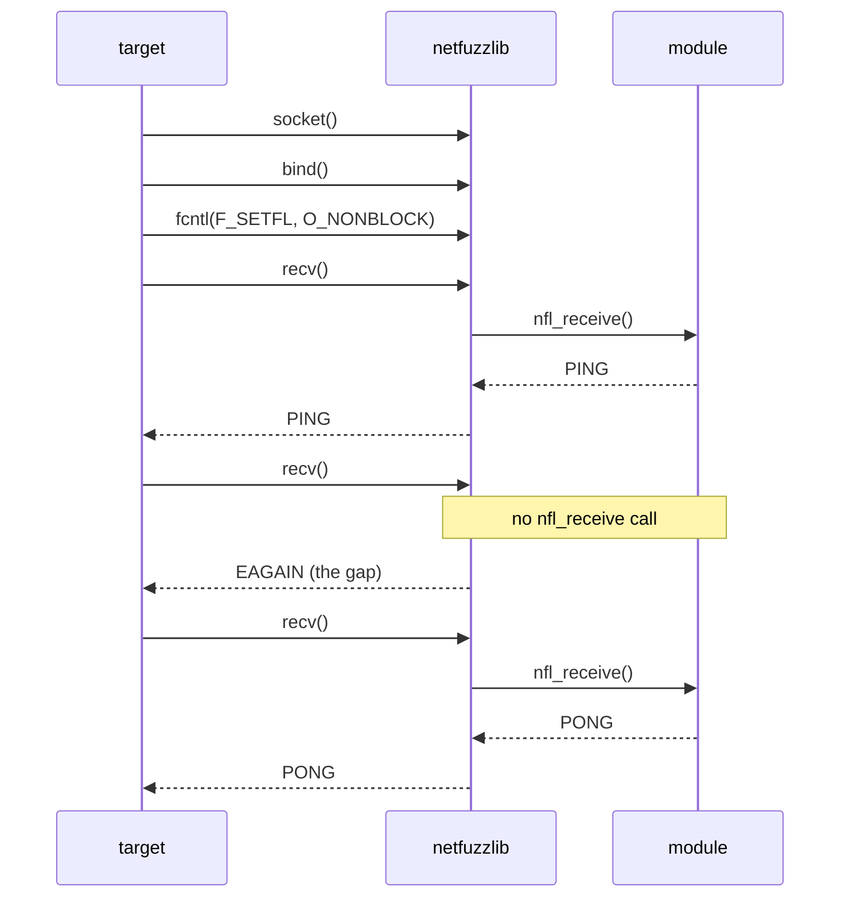
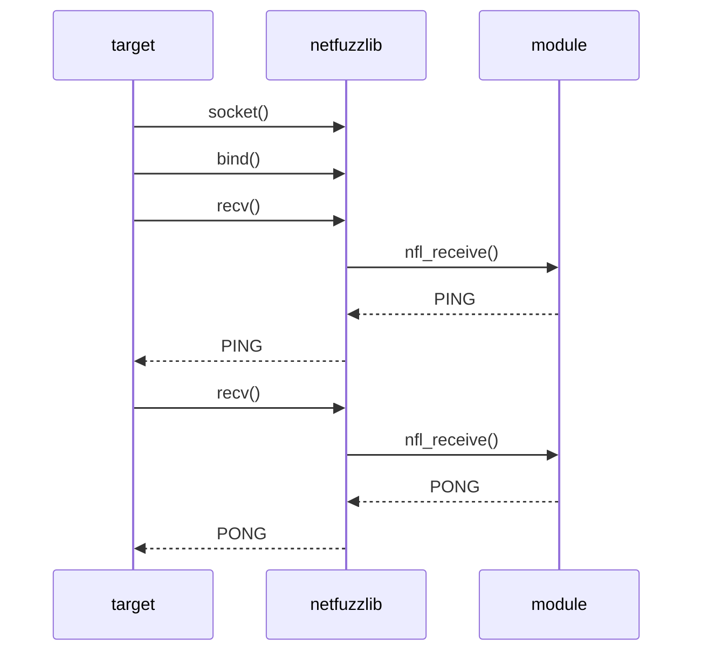

# Message boundaries

netfuzzlib does a call to `nfl_receive` each time the target attempts to acquire
or check whether a new packet or data is available. Between non-blocking read/polls,
the framework makes the target observe an empty socket between packets,
so that targets continue with processing the earlier received data.

For example, a target reads two packets, `PING` then `PONG`, that the module
returns from `nfl_receive`. On a **non-blocking** socket the target sees an empty
read between them, and `nfl_receive` is not called for that empty read:

On a **blocking** socket there is no _gap_: each `recv` returns the next packet
directly:

The gap is only shown to a call that would not block. A call that is willing to
wait is instead handed the next packet, as if it had waited for it to arrive.

## When a call is blocking

A call is **blocking** (skips the gap) when:

- it is a read/recv on a blocking socket (no `MSG_DONTWAIT`), or
- it is a `poll`/`select`/`epoll_wait` with a non-zero timeout, finite or
  infinite.

A call is **non-blocking** (sees the gap) when:

- it is a read/recv on a non-blocking socket, or with `MSG_DONTWAIT`, or
- it is a `poll`/`select`/`epoll_wait` with a zero timeout.

A timed wait counts as blocking on purpose. If a timed `poll` reported "nothing
ready" while a packet was actually waiting behind the gap, the target could
conclude its timeout expired and run a timeout handler, for example
retransmitting a packet or dropping the connection. Handing it the packet avoids
that.

## What each call sees at a packet boundary

Once a packet has been fully read, the next look at the socket meets the gap:

- A **blocking read** returns the next packet. It waited for it.
- A **blocking poll/select** reports the socket ready as soon as the next packet
  is available, and the read that follows returns it.
- A **non-blocking read** returns `EAGAIN` once. The next read returns the packet.
- A **non-blocking poll/select** reports the socket not-ready once. The next poll
  reports it ready.
